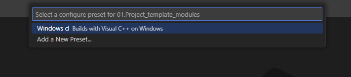

# Setting Up a Modern C++ Development Environment on Windows

Windows is a popular platform for C++ development, with many tools and IDEs available. This guide will help you set up a modern C++ development environment on Windows using Visual Studio Code, CMake, Ninja, and vcpkg. We will install the Visual Studio IDE (different from Visual Studio Code) and integrate the compiler it provides with Visual Studio Code, CMake, and vcpkg. Let's get started!

## 1. Install Visual Studio (Required)

Visual Studio is the recommended IDE for C++ development on Windows. It includes the MSVC compiler, debugger, and build tools. We won't be using this IDE directly in the course, but will use the compiler and debugger that it provides. To install:

- Download and install [Visual Studio](https://visualstudio.microsoft.com/downloads/).
- Double click on the downloaded installer to start the installation process.
- Select the "**Desktop development with C++**" workload during installation.
  - This workload includes the necessary tools for C++ development.
- Once installed, open Visual Studio and see it opens correctly.
- You can now close Visual Studio as we will not be using it directly.
- Confirm that you have access to the cl.exe compiler: 
  - Go to the start menu
  - Search for "Developer Command Prompt for VS 2022" or "Developer PowerShell for VS 2022" or something similar
  - Open the command prompt or PowerShell
  - Type `cl.exe` and press Enter
  - You should see the compiler version information, something like below:
    ```
    PS C:\Users\UserName\source\repos> cl.exe
    Microsoft (R) C/C++ Optimizing Compiler Version 19.41.34123 for x86
    Copyright (C) Microsoft Corporation.  All rights reserved.
    ```
  - If you see the compiler version information, you have successfully installed Visual Studio and the compiler. If you don't see this information, please check the installation steps again.

## 2. Install CMake (Latest Version)

CMake is essential for building C++ projects. Download and install the latest version from [CMake's official site](https://cmake.org/download/). After installation, do the following: 
- Add CMake to your system PATH during installation.
- Verify the installation by running `cmake --version` in a new terminal or powershell window. You should see the installed version of CMake like below: 
  ```
    PS C:\Users\UserName> cmake --version
    cmake version 3.30.2
    CMake suite maintained and supported by Kitware (kitware.com/cmake).
  ```
- If you see the installed version of CMake, you have successfully installed CMake. If you don't see this information, please check the installation steps again.

## 3. Install Ninja (Build System)

Ninja is a fast build system used with CMake. Download it as part of [WinLibs](https://winlibs.com/). Winlibs is a project that provides a set of C++ tools but we just need access to the Ninja tool that comes with it. It also gives us access to other compilers like GCC and Clang on Windows, but we'll just be happy to use the MSVC compiler that comes with the Visual Studio IDE. 
- Download the latest [WinLibs zip file](https://github.com/brechtsanders/winlibs_mingw/releases/download/14.2.0posix-12.0.0-ucrt-r3/winlibs-i686-posix-dwarf-gcc-14.2.0-llvm-19.1.7-mingw-w64ucrt-12.0.0-r3.zip) (latest at the time of writing).

- Extract the downloaded zip file to a folder (e.g., `C:\mingw64`).
- Add the `C:\mingw64\bin` folder to your system PATH.
- That path gives you access to the Ninja executable, together with other tools that come with WinLibs.
- Verify the installation by running `ninja --version` in a new terminal or powershell window. You should see the installed version of Ninja like below:
  ```
    PS C:\Users\UserName> ninja --version
    1.12.1
  ```

## 4. Install git (Version Control System)

Git is a popular version control system used by many developers. Download and install it from [Git's official site](https://git-scm.com/). After installation, do the following:

- Add Git to your system PATH during installation.
- Verify the installation by running `git --version` in a new terminal or powershell window. You should see the installed version of Git like below:
  ```
    PS C:\Users\UserName> git --version
    git version 2.34.1.windows.1
    ```
- If you see the installed version of Git, you have successfully installed Git. If you don't see this information, please check the installation steps again.
- Configure Git with your name and email address using the following commands:
  ```
  git config --global user.name "Your Name"
  git config --global user.email "
    ```
- Replace "Your Name" and "Your Email" with your actual name and email address.
- Verify the configuration by running the following commands:
  ```
  git config --global user.name
  git config --global user.email
  ```
- You should see your name and email address printed on the screen.
- If you see your name and email address, you have successfully configured Git. If you don't see this information, please check the configuration steps again.
- With git, now you can clone repositories, commit changes, and push code to remote repositories. Don't worry if you are not familiar with these terms; we will cover them in the course.
  

## 5. Install vcpkg (Package Manager)

vcpkg is a package manager for C++. It gives us the ability to download third-party packages and use them in our own projects. Very powerful stuff! We will install it through Git. To install it:

- Open a new terminal or PowerShell window.
- Change into the root directory (e.g., `C:\`). I would recommend you do to follow up well with the course.
- Download vcpkg through git with the following command: 
- Run the following command:
    ```bash
    git clone https://github.com/microsoft/vcpkg.git
    ```
- This will download and create a new folder named `vcpkg` in the root directory.
- Change into the `vcpkg` directory with the following command:
    ```bash
    cd vcpkg
    ```
- Run the following command to bootstrap vcpkg:
    ```bash
    bootstrap-vcpkg.bat
    ```
- This will build the vcpkg executable.
- Confirm that you have access to the vcpkg executable by running the following command inside the `vcpkg` directory:
    ```bash
    vcpkg --version
    ```
- You should see the installed version of vcpkg like below:
    ```
    PS C:\vcpkg> vcpkg --version
    2022.01.11-nohash
    ```
- If you see the installed version of vcpkg, you have successfully installed vcpkg. If you don't see this information, please check the installation steps again.
- Now, you can use vcpkg to install third-party libraries and use them in your projects. We will cover how this is done through CMake in the course.

## 6. Install Visual Studio Code (Required)

Visual Studio Code is a lightweight and powerful code editor that supports C++ development. We will use it to write and build our C++ projects in the course. To install:

- Download and install [Visual Studio Code](https://code.visualstudio.com/).
- Open Visual Studio Code and install the following extensions:
  - C++ Environment Extensions (**Choose one of these**):
    - C++ Extension (from Microsoft)
    - Clang tools: 
      - Clangd (from LLVM)
      - CodeLLDB (from Vadim Chugunov)
  - CMake Tools (from Microsoft)
  - CMake (from Microsoft)
  - Other extesions I will be using in the course: 
    - Docker (Optional)
    - Dev Containers (Optional)
    - Vim (Optional)
  - You can install these extensions by clicking on the Extensions icon on the left sidebar and searching for them in the Extensions Marketplace.

## 7. Verify Your Installation

To check that everything is set up correctly, open a new Developer Command Prompt for VS 2022 or Developer PowerShell for VS 2022 window and run the following commands. We need to go through the developer prompt or PowerShell to ensure that the environment variables needed for the `cl` compiler are set correctly.:

```bash
cl.exe /?
cmake --version  # Check CMake
ninja --version  # Check Ninja
vcpkg --version  # Check vcpkg
```

If all commands return valid versions, your setup is complete!

## 8. Put It All Together in Visual Studio Code

If all the setup was successful, you can now use one of the template projects as a starting point. We will be using C++20 Modules as a first class citizen in the course, so you can start with the `01.Project_template_modules` template project.

Open the folder `01.Project_template_modules` in Visual Studio Code and build the project. You can do this by dragging the folder and dropping it into Visual Studio Code or by opening Visual Studio Code and selecting `File > Open Folder...` and selecting the folder.

Our project is using a feature named **CMake Presets** to make it easier to configure and build the project. To make sure everything works as expected selet `View > Command Palette...` and start typing `CMake: Select Configure Preset`. Choose the option when it shows up, and you will be presented with a list of presets. Our starter project is configured to use the Visual C++ compiler on Windows, so that's the preset that will show up and that you should choose.



Click on the option saying `Windows cl Builds with Visual C++ on Windows` and your project should start configuration. A terminal window will open at the bottom of Visual Studio Code and you will see the output of the configuration process. Give it a few seconds to complete. If everything goes well, you should see a terminal output message saying that the build files have been written to some location on your file system. Something like below: 

```bash
[cmake] -- Detecting CXX compile features - done
[cmake] -- Configuring done (3.9s)
[cmake] -- Generating done (0.0s)
[cmake] -- Build files have been written to: F:/OnlineCourses/Cpp23Masterclass/CodeLive/02.EnvironmentSetup/01.Project_template_modules/build/cl
```

If you see something different, or if you see an error message, please let me know in the course Q&A section, and I will help you troubleshoot the issue.

At this point I assume that your build files have been generated successfully. Now, let's understand a bit about what CMake just did for us.  From the output, you can see that my initial project is stored in the `F:/OnlineCourses/Cpp23Masterclass/CodeLive/02.EnvironmentSetup/01.Project_template_modules` folder. 

As a result of our configuration, CMake generated a new folder named `build` inside the project folder. This is where the build files are stored. The `cl` folder inside the `build` folder is where the actual build files are stored.

Things are working this way because of the settings stored in the `CMakePresets.json` file in the project folder. This file tells CMake how to configure the project. You don't need to worry or understand all the details of this file right now, but you need to understand and know where your build files are stored; and now you know.  Great!

The next thing to do is to build the project. You can do this by selecting `View > Command Palette...` and start typing `CMake: Build`. Choose the option when it shows up, and you will see the build process in the terminal window. If everything goes well, you should see a message saying that the build was successful. Something like below:

```cmake
...
[build] [1/6] Scanning F:\OnlineCourses\Cpp23Masterclass\CodeLive\02.EnvironmentSetup\01.Project_template_modules\main.cpp for CXX dependencies
[build] [2/6] Scanning F:\OnlineCourses\Cpp23Masterclass\CodeLive\02.EnvironmentSetup\01.Project_template_modules\utilities.ixx for CXX dependencies
[build] utilities.ixx
[build] [3/6] Generating CXX dyndep file CMakeFiles\Rocket.dir\Debug\CXX.dd
[build] [4/6] Building CXX object CMakeFiles\Rocket.dir\Debug\utilities.ixx.obj
[build] utilities.ixx
[build] [5/6] Building CXX object CMakeFiles\Rocket.dir\Debug\main.cpp.obj
[build] [6/6] Linking CXX executable Debug\Rocket.exe
[driver] Build completed: 00:00:01.352
[build] Build finished with exit code 0
```
CMake goes through a series of steps to build the project. And by ***building the project***, I mean that CMake is calling the compiler to compile the source files and link them together to create an executable. The executable in this case is named `Rocket.exe` and is stored in the `Debug` folder inside the `cl` folder. For clarity, the full path to the executable is `F:/OnlineCourses/Cpp23Masterclass/CodeLive/02.EnvironmentSetup/01.Project_template_modules/build/cl/Debug/Rocket.exe` in my case.

The binary named `Rocket.exe` is the executable that you can run. This is the whole point for you going through this course, building binary executables that you or other people can run and get important work done. Visual Studio Code itself  that we are using is a binary executable that gets run when you click or double click on it. The same goes for the `Rocket.exe` binary that we just built.

Now we have the executable, and the next step is to run it. Inside Visual Studio Code, you clikc on the play button at the bottom of the window.


Clicking that will run the executable and you should see the output of the program in the terminal window. If everything goes well, you should see the output of the program in the terminal window. Something like below:

```
PS F:\OnlineCourses\Cpp23Masterclass\CodeLive\02.EnvironmentSetup\01.Project_template_modules\build\cl\Debug> ."F:/OnlineCourses/Cpp23Masterclass/CodeLive/02.EnvironmentSetup/01.Project_template_modules/build/cl/Debug/Rocket.exe"
Hello, World!
```

The output of the program is `Hello, World!`, but the output from the terminal clearly states that it is the binary file named `Rocket.exe` that is being run, and it is stored in the `build/cl/Debug/` from the perspective of the project root folder. The project root folder is `F:/OnlineCourses/Cpp23Masterclass/CodeLive/02.EnvironmentSetup/01.Project_template_modules` in my case.