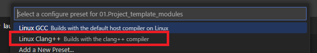
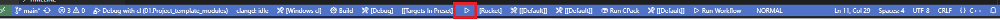
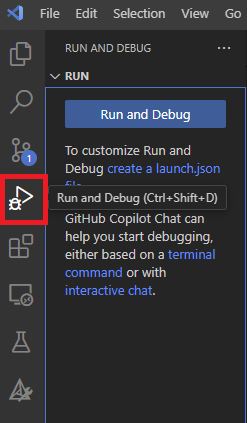
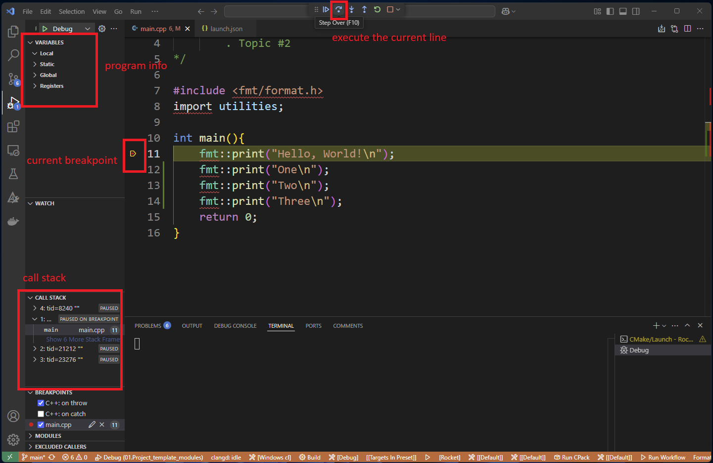

# Setting Up a Modern C++ Development Environment on macOS

This guide will walk you through setting up a modern C++ development environment on macOS using the default Apple Clang compiler, CMake, vcpkg, Ninja, and Visual Studio Code. We will stick to system-provided tools as much as possible.

⚠️ ***Note***: Apple clang is known for lagging behind the latest C++ standards. If you are on a Mac, we still recommend you use it as it will compile at least 80% of the code you write in this course. If it happens to let you down, you can use the [docker instll guide]() to see how you can get access to better compilers like LLVM Clang or GCC.

## 1. Install Xcode Command Line Tools

macOS comes with a default Clang compiler, but you need to install the Xcode Command Line Tools to use it.

### Steps:
1. Open a terminal (press `Cmd + Space`, type `Terminal`, and press `Enter`).
2. Run the following command:
   ```sh
   xcode-select --install
   ```
3. Follow the on-screen instructions to complete the installation.

To verify the installation:
```sh
clang --version
```
This should display Apple’s Clang version, confirming that it is installed.

## 2. Install CMake

CMake is a popular build system generator required for modern C++ projects.

### Steps:
1. Download CMake from the official website: [https://cmake.org/download/](https://cmake.org/download/).
2. Open the downloaded `.dmg` file and follow the installation instructions.
3. Ensure CMake is available in the terminal:
   ```sh
   cmake --version
   ```

## 3. Install Ninja

Ninja is a fast build system often used with CMake.

### Steps:
1. Download the latest macOS binary from [https://github.com/ninja-build/ninja/releases](https://github.com/ninja-build/ninja/releases).
2. Extract the binary and move it to `/usr/local/bin`:
   ```sh
   sudo mv ninja /usr/local/bin/
   chmod +x /usr/local/bin/ninja
   ```
3. Verify the installation:
   ```sh
   ninja --version
   ```

## 4. Install vcpkg for Package Management

vcpkg is a C++ package manager that simplifies dependency management.

### Steps:
1. Clone the vcpkg repository into your home directory:
   ```sh
   git clone https://github.com/microsoft/vcpkg.git ~/vcpkg
   ```
2. Navigate to the vcpkg directory:
   ```sh
   cd ~/vcpkg
   ```
3. Bootstrap vcpkg:
   ```sh
   ./bootstrap-vcpkg.sh
   ```
4. Add vcpkg to your path:
   ```sh
   echo 'export PATH="$HOME/vcpkg:$PATH"' >> ~/.zshrc
   source ~/.zshrc
   ```
5. Verify vcpkg installation:
   ```sh
   vcpkg --version
   ```
6. Setup a `VCPKG_ROOT` environment variable to point to the vcpkg directory. This will make it easier to use vcpkg with CMake. On Mac, you can do this by:
  - Opening the `.zshrc` file in your home directory using the editor of your choice. For example:
    ```sh
    nano ~/.zshrc
    ```
   - Adding the following line to the end of the file:
      ```sh 
      export VCPKG_ROOT="$HOME/vcpkg"
      ```
   - Save the file and exit the editor.
   - Run the following command to apply the changes:
      ```sh
      source ~/.zshrc
      ```


   

## 5. Install Visual Studio Code

Visual Studio Code is a lightweight and powerful code editor that supports C++ development. We will use it to write and build our C++ projects in the course. To install:

- Download and install [Visual Studio Code](https://code.visualstudio.com/).
- Open Visual Studio Code and install the following extensions:
  - C++ Environment Extensions (**Choose one of these**):
    - C++ Extension (from Microsoft)
    - Clang tools (This is  what I will use in the course): 
      - Clangd (from LLVM)
      - CodeLLDB (from Vadim Chugunov)
  - CMake Tools (from Microsoft)
  - CMake (from Microsoft)
  - Other extesions I will be using in the course: 
    - Docker (Optional)
    - Dev Containers (Optional)
    - Vim (Optional)
  - You can install these extensions by clicking on the Extensions icon on the left sidebar and searching for them in the Extensions Marketplace.

## 6. Verify Your Installation

To check that everything is set up correctly, open a new Developer Command Prompt for VS 2022 or Developer PowerShell for VS 2022 window and run the following commands. We need to go through the developer prompt or PowerShell to ensure that the environment variables needed for the `cl` compiler are set correctly.:

```bash
clang --version  # Check Clang
cmake --version  # Check CMake
ninja --version  # Check Ninja
vcpkg --version  # Check vcpkg
```
If all commands return valid versions, your setup is complete!


## 7. Put It All Together in Visual Studio Code: Building and Running your First C++ Program

If all the setup was successful, you can now use one of the template projects as a starting point. We would like to use C++20 Modules as a first class citizen in this course, but the default tools on Mac may not support it. So we will start with a project that uses headers only.

> ⚠️ **Note**: If you want to use bleeding edge features like C++20 Modules, and other C++23 features on a Mac, you can use the [Docker setup guide]() to set up a Linux environment with the latest tools. It is still important to have a local environment that does the best it can, but in case you need to try out the latest features, you can use the Docker setup. It's OK to have them both set up.

Open the folder `02.Project_template_headers` in Visual Studio Code. You can do this by dragging the folder into Visual Studio Code or by opening Visual Studio Code and selecting `File > Open Folder...` and selecting the folder.

Our project uses **CMake Presets** to configure and build the project easily. To make everything work as expected, select `View > Command Palette...` and start typing `CMake: Select Configure Preset`. Choose the option when it appears, and you'll see a list of presets. For Linux with Clang, select the `Linux Clang++ Builds with the clang++ compiler` preset.

> ⚠️ **Note**: On Mac, using the default tools, you may not have access to C++23 or even C++20 features. In that case, you may get errors after the configuration step. If that happens, try to change the C++ standard in the `CMakeLists.txt` file to C++20. If that doesn't work, change it to C++17.



> ⚠️ **Note**: I don't have access to a Mac system and the screenshots are from a Linux system. The steps should be similar on a Mac system. But the preset should be saying something like `MacOS Clang++ Builds with the clang++ compiler`.

After selecting the preset, your project will begin configuration. A terminal window will open at the bottom of Visual Studio Code showing the output of the configuration process. After a few seconds, you should see a message indicating that the build files have been written, something like:

```bash
[cmake] -- Detecting CXX compile features - done
[cmake] -- Configuring done (3.9s)
[cmake] -- Generating done (0.0s)
[cmake] -- Build files have been written to: /home/daniel/OnlineCourses/Cpp23Masterclass/CodeLive/02.EnvironmentSetup/02.Project_template_headers/build/linux_clang
```

If you see something different or an error message, please ask for help in the course Q&A section.

Now let's understand what CMake did for us. From the output, you can see that the project is stored in `/home/daniel/OnlineCourses/Cpp23Masterclass/CodeLive/02.EnvironmentSetup/02.Project_template_headers`.

CMake generated a new folder named `build` inside the project folder where build files are stored. The `clang` folder inside the `build` folder contains the actual build files.

This happens because of the settings in the `CMakePresets.json` file in the project folder, which tells CMake how to configure the project. You don't need to understand all the details right now, just know where your build files are stored.

Next, build the project by selecting `View > Command Palette...` and typing `CMake: Build`. When the build process completes successfully, you should see output similar to:

```cmake
...
[build] [1/6] Scanning /home/daniel/OnlineCourses/Cpp23Masterclass/CodeLive/02.EnvironmentSetup/02.Project_template_headers/main.cpp for CXX dependencies
[build] [2/6] Scanning /home/daniel/OnlineCourses/Cpp23Masterclass/CodeLive/02.EnvironmentSetup/02.Project_template_headers/utilities.ixx for CXX dependencies
[build] utilities.ixx
[build] [3/6] Generating CXX dyndep file CMakeFiles/Rocket.dir/Debug/CXX.dd
[build] [4/6] Building CXX object CMakeFiles/Rocket.dir/Debug/utilities.ixx.obj
[build] utilities.ixx
[build] [5/6] Building CXX object CMakeFiles/Rocket.dir/Debug/main.cpp.obj
[build] [6/6] Linking CXX executable Debug/Rocket
[driver] Build completed: 00:00:01.352
[build] Build finished with exit code 0
```

CMake compiles the source files and links them together to create an executable. The executable is named `Rocket` (no .exe extension on Linux) and is stored in the `Debug` folder inside the `linux_clang` folder. The full path in our example would be `/home/daniel/OnlineCourses/Cpp23Masterclass/CodeLive/02.EnvironmentSetup/02.Project_template_headers/build/linux_clang/Debug/Rocket`.

This executable is the output of your programming efforts. To run it, click the play button at the bottom of the window.



Clicking this will run the executable, and you'll see the program's output in the terminal window:

```
$ "/home/daniel/OnlineCourses/Cpp23Masterclass/CodeLive/02.EnvironmentSetup/02.Project_template_headers/build/linux_clang/Debug/Rocket"
Hello, World!
```

The output is `Hello, World!`, with the terminal showing that it's running the `Rocket` binary from the `build/linux_clang/Debug/` directory.

## 8. Debugging C++ and Running Things Like a Pro in Visual Studio Code

To take full advantage of Visual Studio Code and the tools we installed, let's set up debugging and learn some shortcuts.

First, ensure your project folder structure looks like this:

```
  ├── 02.Project_template_headers/
  │   ├── CMakeLists.txt
  │   ├── CMakePresets.json
  │   ├── main.cpp
  │   ├── utilities.ixx
  │   ├── vcpkg.json
  │   └── build
```

Click on the `Run and Debug` icon on the left sidebar of Visual Studio Code (it looks like a play button with a bug on it).



Since we don't have configurations yet, click the `create a launch.json file` link and select the `CodeLLDB: Launch` configuration. This works because we installed the `CodeLLDB` extension earlier, which helps Visual Studio Code understand and debug C++ code.

The generated `launch.json` file should look like this:

```json
{
    // Use IntelliSense to learn about possible attributes.
    // Hover to view descriptions of existing attributes.
    // For more information, visit: https://go.microsoft.com/fwlink/?linkid=830387
    "version": "0.2.0",
    "configurations": [
        {
            "type": "lldb",
            "request": "launch",
            "name": "Debug",
            "program": "${workspaceFolder}/<executable file>",
            "args": [],
            "cwd": "${workspaceFolder}"
        }
    ]
}
```

Replace `<executable file>` with the path to the executable: `build/linux_clang/Debug/Rocket`. The updated file should look like:

```json
{
    // Use IntelliSense to learn about possible attributes.
    // Hover to view descriptions of existing attributes.
    // For more information, visit: https://go.microsoft.com/fwlink/?linkid=830387
    "version": "0.2.0",
    "configurations": [
        {
            "type": "lldb",
            "request": "launch",
            "name": "Debug",
            "program": "${workspaceFolder}/build/linux_clang/Debug/Rocket",
            "args": [],
            "cwd": "${workspaceFolder}"
        }
    ]
}
```

Save the file. Now you can go to the Run Menu and click on `Start Without Debugging` or press `Ctrl + F5` to run the program.

To see debugging in action, let's modify our `main.cpp` file:

```cpp    
int main(){
    fmt::print("Hello, World!\n");
    fmt::print("one\n");
    fmt::print("two\n");
    fmt::print("three\n");
    return 0;
}
```

Rebuild the program using `CMake: Build` from the Command Palette or by pressing `F7`.

Run the program with `Ctrl + F5` to see the output:

```
Hello, World!
one
two
three
```

Now let's debug it step by step. Set a breakpoint by clicking to the left of line 11 in `main.cpp` where a red dot will appear.

To run the program in debug mode, go to the Run Menu and click `Start Debugging` or press `F5`. The program will pause at your breakpoint.



You can now see the program state in the left panel, including variables and the call stack. To execute line by line, click the `Step Over` button or press `F10`. Each time you step over, the next line executes and the program pauses again.

## 9. Conclusion

In this guide, we set up a modern C++ development environment on Linux using Visual Studio Code, CMake, Ninja, and vcpkg. We installed Clang, CMake, Ninja, Git, vcpkg, and Visual Studio Code. We also learned how to build and run a C++ program in Visual Studio Code and how to debug it.

We covered a lot of ground, and I hope you now feel comfortable with these tools and are ready to start using C++ to build amazing projects. If you have any questions or run into issues, please ask in the course Q&A section.

> ⚠️ **Warning:** You'll need the launch.json file you set up earlier for other projects we create in this course. Copy it to the root of any new project to make building and debugging easier. If the structure of the project changes, you may need to adapt the path to the executable in the launch.json file.


